# Spring API + Auth +JWT

---
## Description
> Learning how to create a Spring API and JWT authentication.
### Detail
- Api: RESTFUL and validation.
- Auth: Spring security and jwt token.
- Validation: Custom validation, Global exception handler.
- Database: MySQL.
- Seeding: Data seeding.

### How to run project
1. Clone project from [https://github.com/limbanga/springboot_basic.git](https://github.com/limbanga/springboot_basic.git).
> branch: `master`
2. Config Database in `application.properties`.

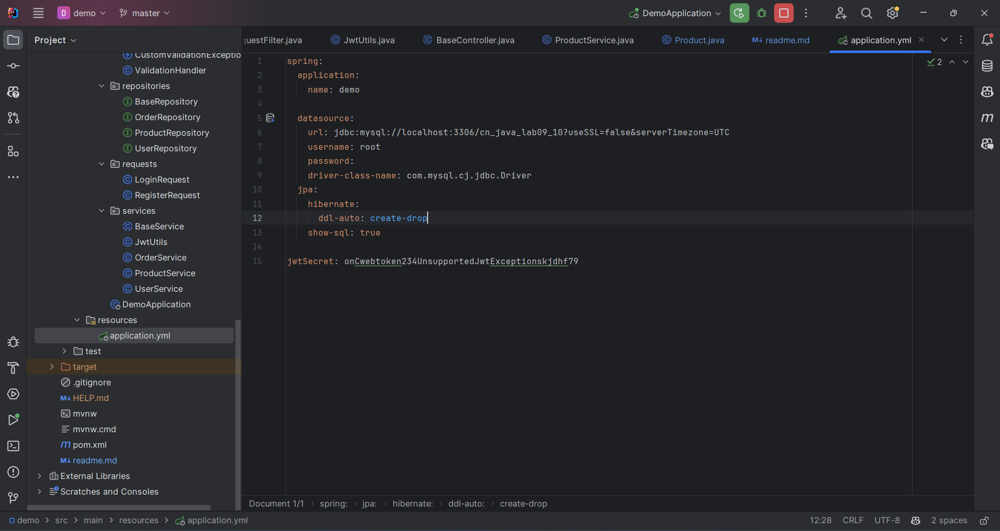
3. Using `mvn clean install` to build project.
4. Run project with `mvn spring-boot:run`.
5. Test API with Postman.
6. Enjoy! :3 mew mew
### Seeding data 
> u can change logic here to seed data.
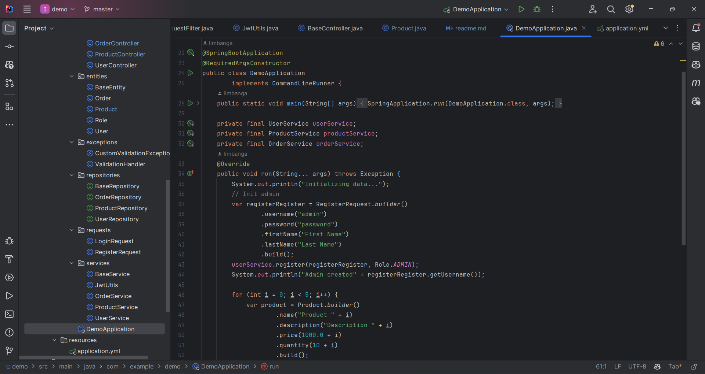
### Test

> Test the API with Postman.
1. Product:
- get all product: `GET /api/product/`

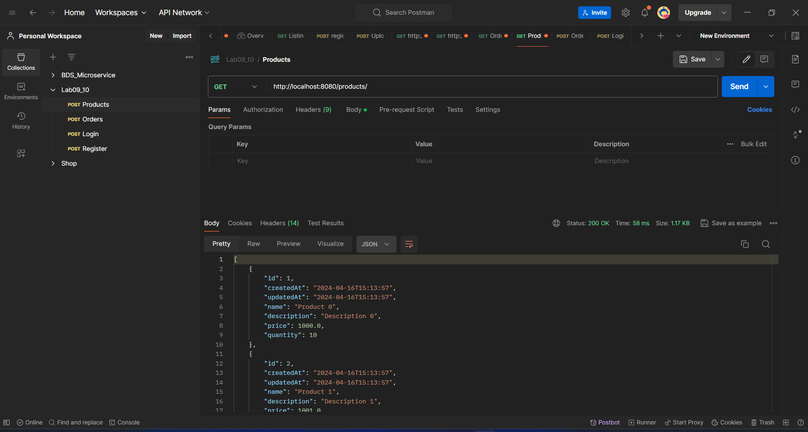

- get product by id: `GET /api/product/{id}`

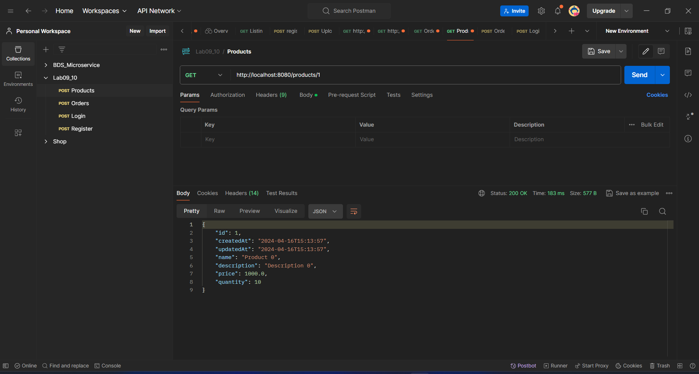

- create product: `POST /api/product/`

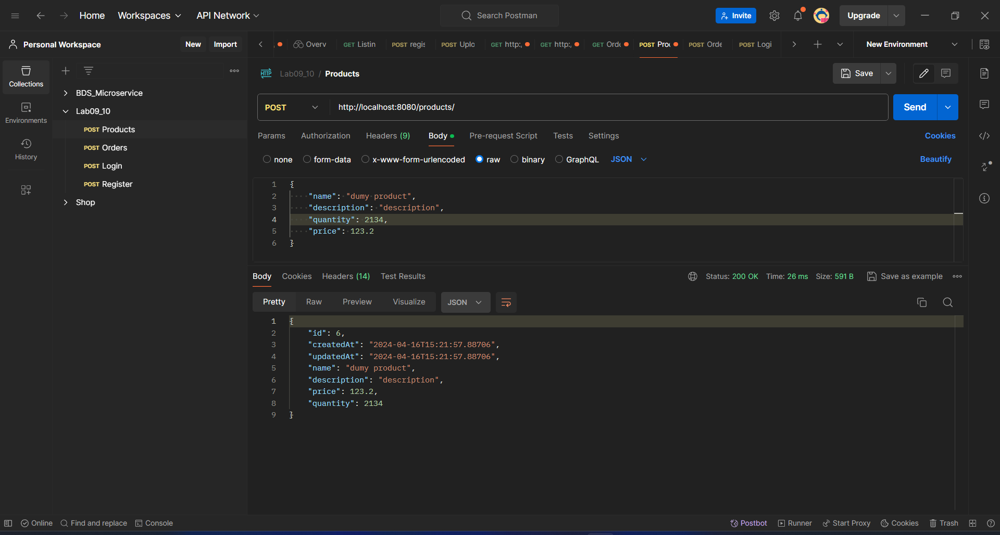

- update product: `PUT /api/product/`

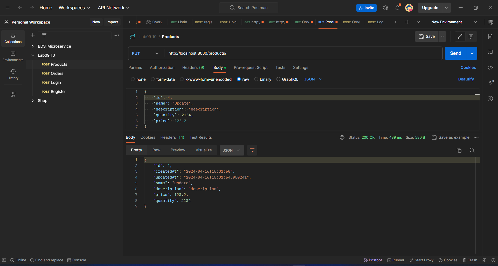
> example validation
>
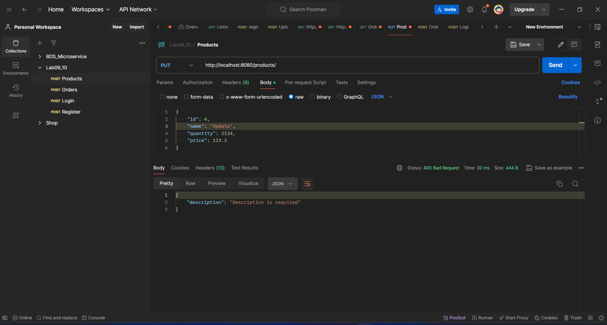

- set active product: `PATCH /api/product/`
> set active product by id. only admin can set active product. 

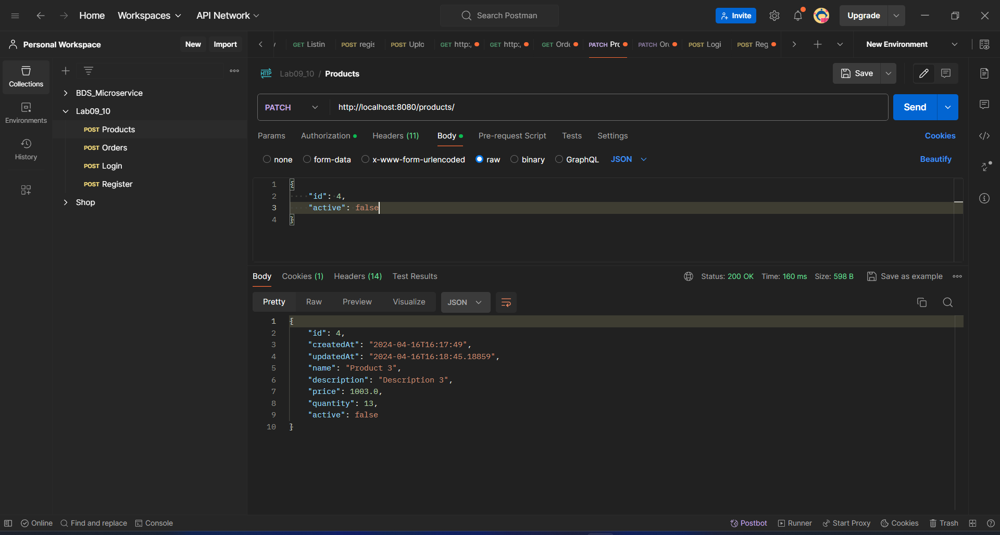

- delete product: `DELETE /api/product/{id}`

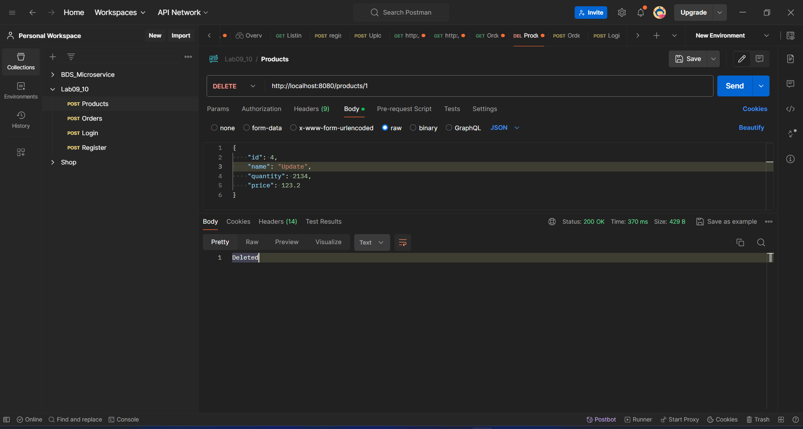

2. Order:
- get all order: `GET /api/order/`

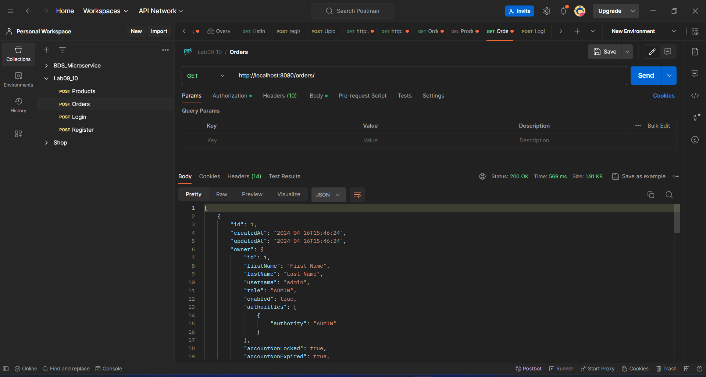

- get order by id: `GET /api/order/{id}`

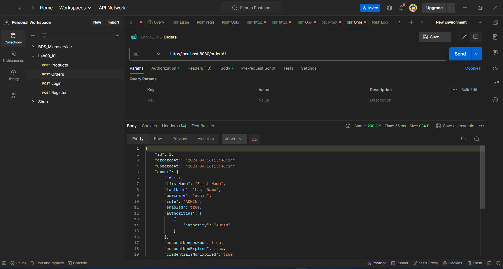

- create order: `POST /api/order/`
> owner of order is the user who created it. (get from jwt token)
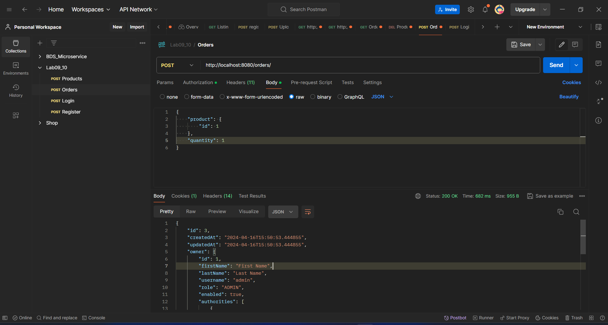

- update order: `PUT /api/order/`
> Only admin can update order.
> 
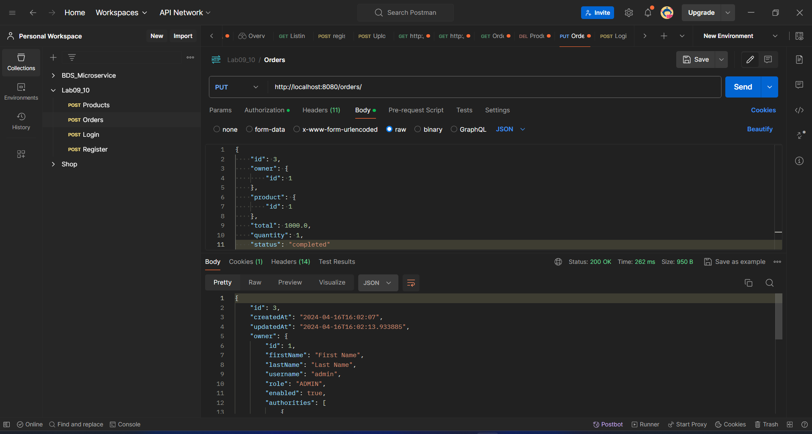

- delete order: `DELETE /api/order/{id}`
- Only admin can delete order.

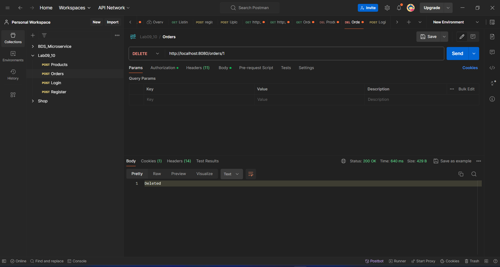

3. Auth:
- login: `POST /api/auth/login`

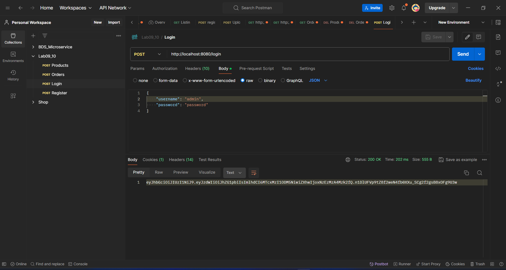

- register: `POST /api/auth/register`

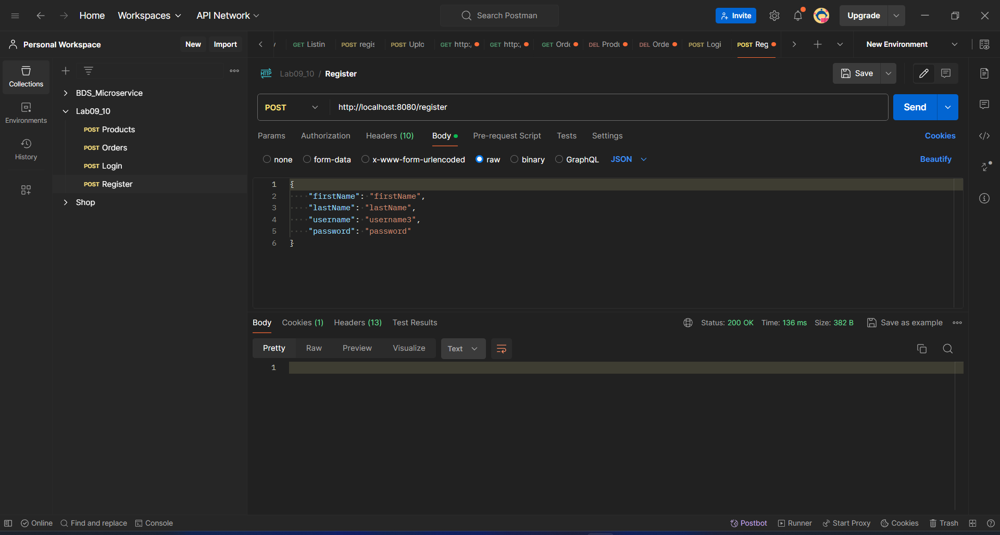
> if username existed
> 

- access security endpoint:

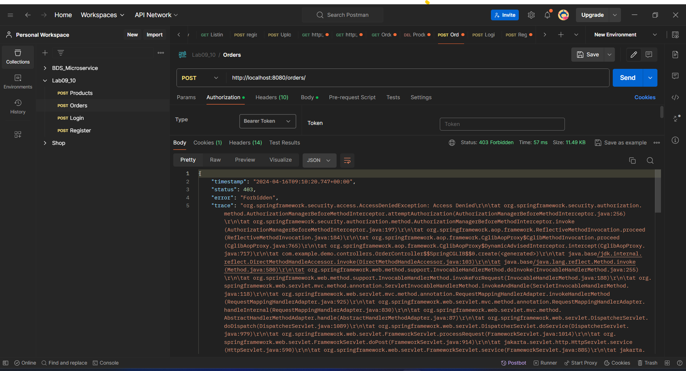
