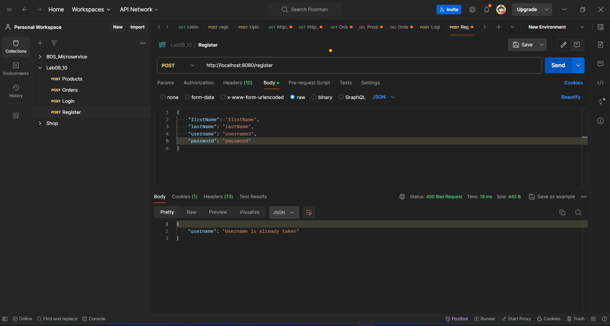

# Spring API + Auth +JWT

---
## Description
> Learning how to create a Spring API and JWT authentication.
### Detail
- Api: RESTFUL and validation.
- Auth: Spring security and jwt token.
- Validation: Custom validation, Global exception handler.
- Database: MySQL.
- Seeding: Data seeding.

### How to run project
1. Clone project from [https://github.com/limbanga/springboot_basic.git](https://github.com/limbanga/springboot_basic.git).
> branch: `master`
2. Config Database in `application.properties`.

3. Using `mvn clean install` to build project.

4. Run project with `mvn spring-boot:run`.

6. Test API with Postman.

7. Enjoy! :3 mew mew

8. If you want to config cors, you can config in `SecurityConfigurer.java`.

### Seeding data 
> u can change logic here to seed data.

### Test

> Test the API with Postman.
1. Product:
- get all product: `GET /product/`

- get product by id: `GET /product/{id}`

- create product: `POST /product/`

- update product: `PUT /product/`

> example validation
>

- set active product: `PATCH /product/`
> set active product by id. only admin can set active product. 

- delete product: `DELETE /product/{id}`

2. Order:
- get all order: `GET /order/`

- get order by id: `GET /order/{id}`

- create order: `POST /order/`
> owner of order is the user who created it. (get from jwt token)

- update order: `PUT /order/`
> Only admin can update order.
> 

- delete order: `DELETE /order/{id}`
- Only admin can delete order.

3. Auth:
- login: `POST /login`

- register: `POST /register`

> if username existed
> 

- access security endpoint:

